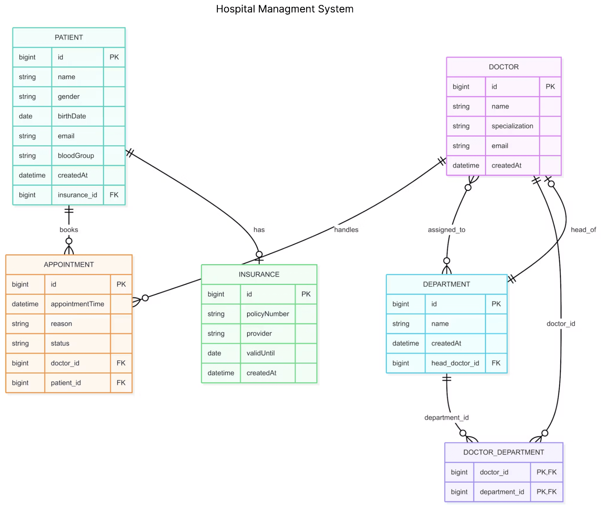

git

class OS {
    private PaymentService pS= new PaymentService();
}
Issues :
tightly coupled : we cannot use any other kind of payment service in OS
lesser extensibility
hard to test
scattered object creation throughout the code base

Dependency Inversion is a design principle that states that high-level modules should not depend on low-level implementations.
IOC - Inversion of Control is a design pattern that implements Dependency Inversion principle.
It is a technique in which the control of object creation and dependency management is inverted from the application code to a container or framework.
Dependency Inversion is a principle that guides the design of software, 
while Inversion of Control is a pattern that implements that principle.

Hibernate is ORM framework.
It is one of the implementations of JPA.
JPA is standard specification for ORM in Java.
JPA defines a set of interfaces and annotations that can be used to map Java objects to relational database tables.
JPA is abstract layer over ORM frameworks like Hibernate, EclipseLink, and OpenJPA. 
Hibernate has additional features than JPA specification as well.

Spring Data JPA is built on top of JPA and provides additional features like repository support, query derivation, custom query support, pagination and sorting. 
It helps to reduce boilerplate code we need to write and simplifies the data access layer in Spring applications.
SimpleJpaRepository is implementation of JpaRepository interface that we use.

For primitives , lombok generates getters as isActive()
For wrapper classes or objects ( eg. Boolean ) , it generates getters as getIsActive()
and jackson's interpretation differs on both the method names , isActive() -> "active" , getIsActive() -> 'isActive'

Page -> actual data
Pageable(interface) -> PageRequest(impl of Pageable)
Pageable can contain sort within itself , and it can be passed to any of the query methods

Projections can be used to retrieve partial data from DB , if we use interface to extract , then it is read only

Hibernate Entity Lifecycle
JpaRepository(interface) -> SimpleJpaRepository(impl) -> this class has reference to EntityManager
Whenever we get some data from entity manager , the entity goes through a lifecycle 
Entity -> when we create a object using new it goes to Transient state
when we save update this , the entity goes to Persistent state
if we do not do anything , it gets garbage collected
when we get entity , it is in Persistent state
when delete it , it goes to Removed state from Persistent
when we detach or close it from Persistent state , it goes to Detached state
Detached state can go back to Persistent state
Removed state cannot go back to Persistent state , it gets garbage collected

In one transaction , if we persist a entity , it goes into PersistenceContext
if we again call getById or we try to fetch it in same transaction , no new db call is made , the entity is fetched from PersistenceContext itself
In short , whenever we do find in Transactional , the data is searched in PersistenceContext first
Inside a Transactional , if we make any changes to data that is in persistent state, at the end of transaction , any changes to data gets synced with the DB , even if we do not make a explicit save call

Hospital Management ER Diagram :

public enum CascadeType {
        ALL,
        PERSIST, -> when owning side saved/persisted , save inverse side
        MERGE, -> when owning side updated , also update inverse side , if there are any updates
        REMOVE, -> when owning side deleted , deleted inverse side
        REFRESH, -> when refreshed / get
        DETACH; -> when linkage detached , please cascade it to inverse side
}

